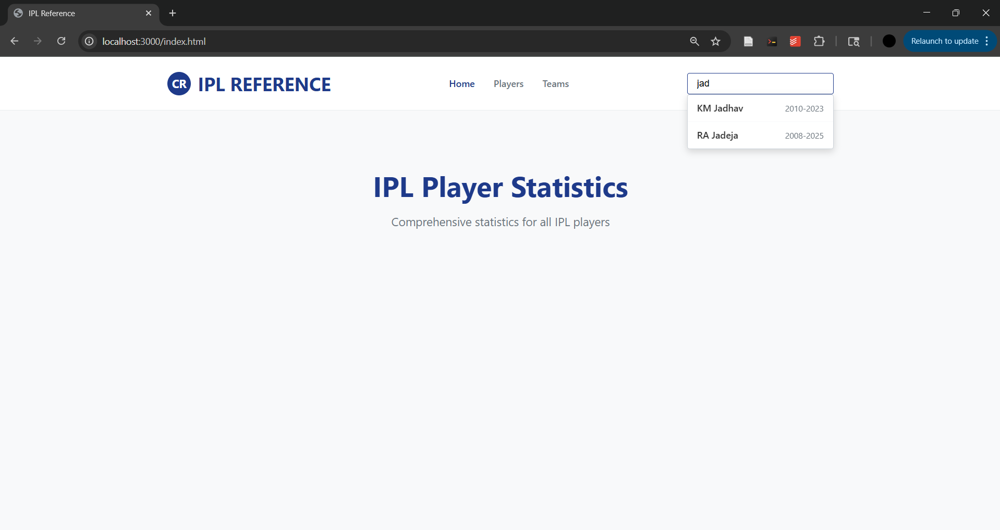
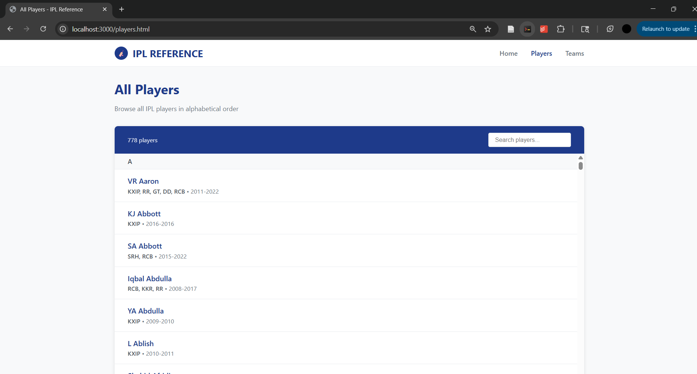
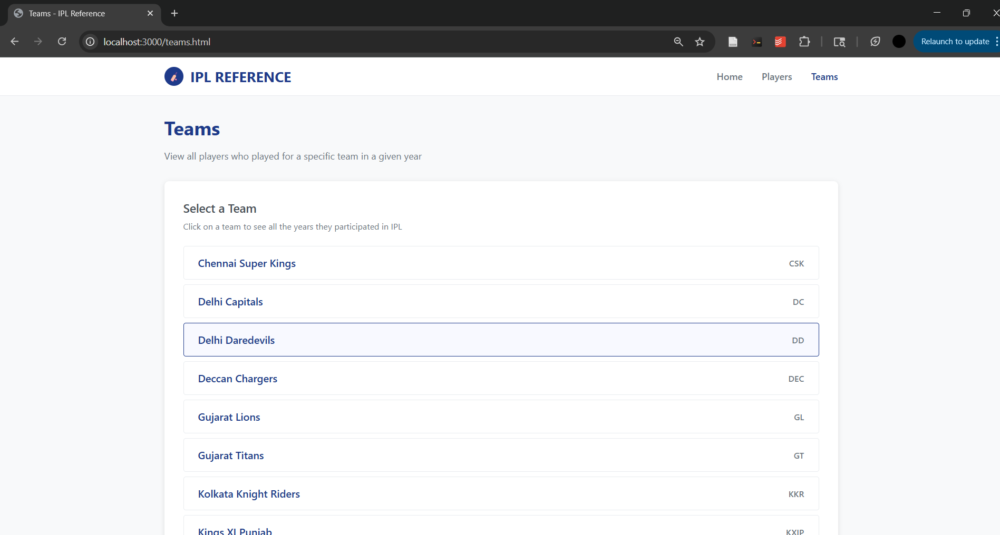
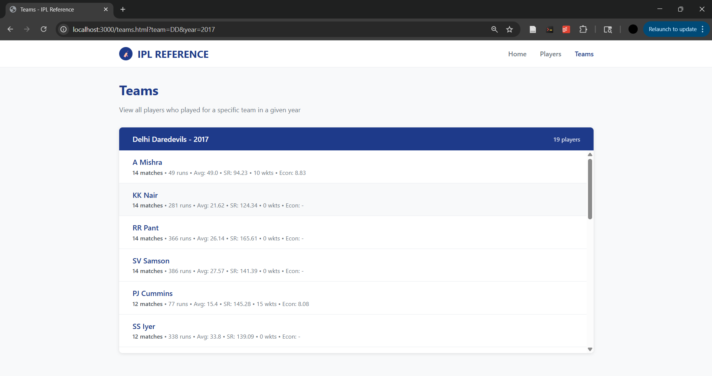
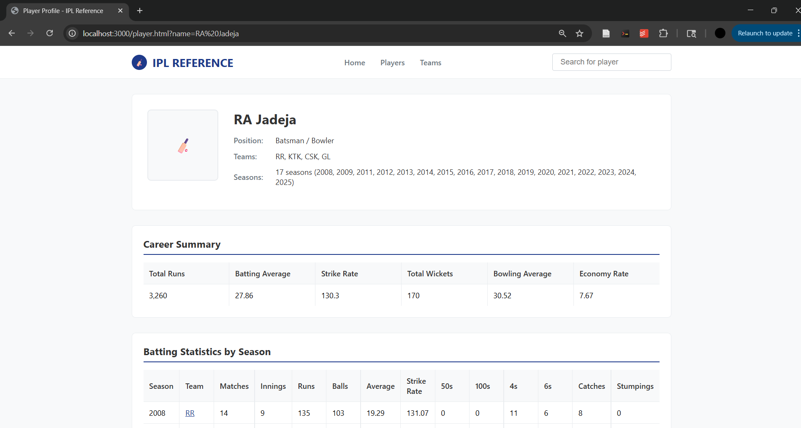
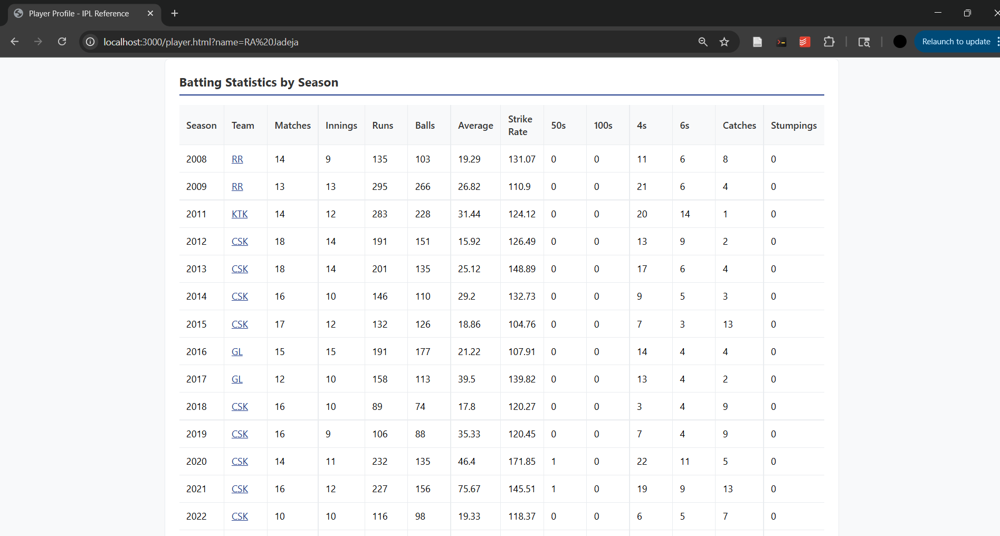
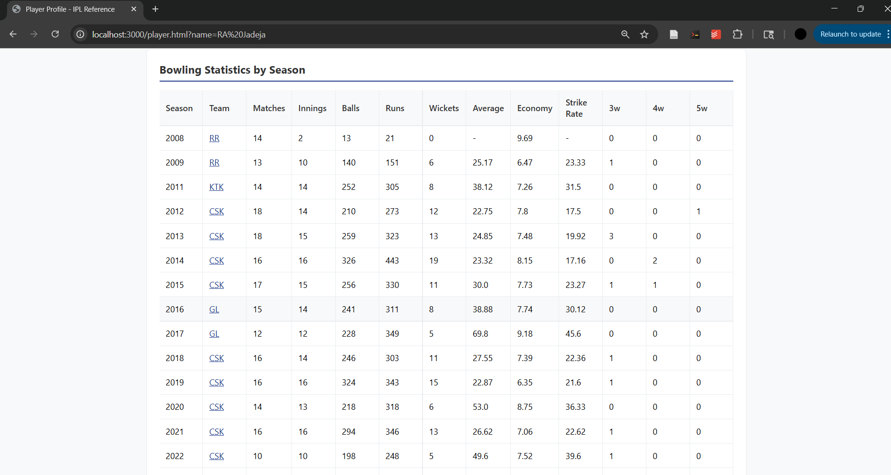
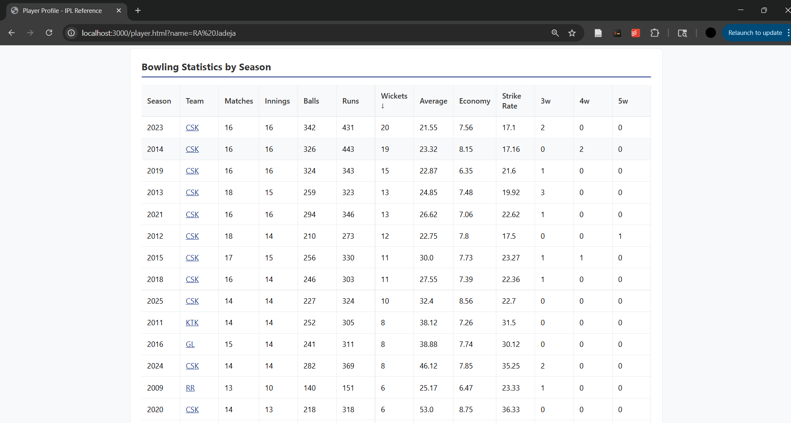

# IPL Reference

A comprehensive cricket statistics platform for the Indian Premier League (IPL), featuring detailed player analytics and team statistics. Data sourced from [CricSheets](https://cricsheet.org/).

## Features

- **Player Search**: Find any IPL player with autocomplete search functionality
- **Detailed Statistics**: View comprehensive batting and bowling statistics for each player, either season by season or for their entire career.
- **Team Analysis**: Browse players by team and season

## Screenshots

### Main Pages

*Search for any IPL player with autocomplete functionality*


*Complete A-Z listing of all IPL players with teams and years*


*Team selection interface*


*Team-year player results with comprehensive statistics*

### Player Profile

*Player information header with photo placeholder and basic stats*


*Batting statistics table with comprehensive metrics*


*Bowling statistics table with comprehensive metrics*


*Stats table sorting functionality*

## Technologies Used

- **Frontend**: HTML5, CSS3, JavaScript, React (via Babel)
- **Backend**: Python, FastAPI, Uvicorn
- **Data Processing**: Pandas, JSON

## Project Structure

```
IPL Reference/
├── api/                    # FastAPI backend
├── player_data/           # Processed CSV data
├── ipl_data/             # Raw JSON match data (CricSheets)
├── index.html            # Home page
├── player.html           # Player profile page
├── players.html          # Players directory
├── teams.html            # Team players page
├── parse_and_aggregate.py # Raw JSON data processing
└── career_stats.py       # Career stat calculations
```

## Installation & Setup

1. **Clone the repository**
   ```bash
   git clone https://github.com/yourusername/ipl-reference.git
   cd ipl-reference
   ```

2. **Install dependencies**
   ```bash
   pip install -r requirements.txt
   ```

3. **Start the backend server**
   ```bash
   python api/run_server.py
   ```

4. **Open the frontend**
   ```bash
   python -m http.server 3000
   ```
   - Then visit `http://localhost:3000`

## API Endpoints

- `GET /players` - Get all players
- `GET /player/{name}/batting` - Get player batting statistics
- `GET /player/{name}/bowling` - Get player bowling statistics
- `GET /player/{name}/career` - Get player career summary

## Key Features

### Player Search & Profiles
- Autocomplete search with player names and years
- Comprehensive batting and bowling statistics
- Career totals and averages
- Team history and season breakdown

### Team Analysis
- Browse players by team selection
- Year-by-year team rosters

### Data Visualization
- Clean, responsive grid layouts
- Easy access to both season and career statistics

